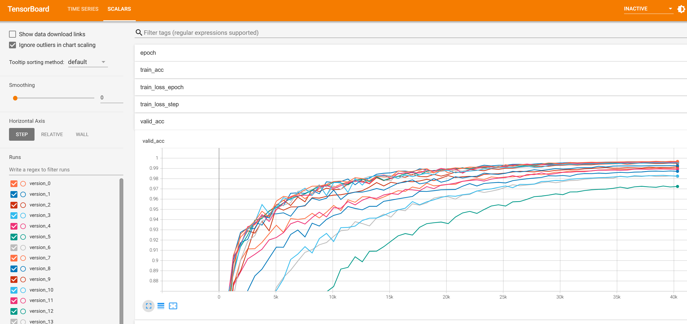

# Processing neuromorphic events directly by representations in vector space

This repo contains the source codes, training logs, and models of the arxiv article **Event2Vec: Processing neuromorphic events directly by representations in vector space**.

## Requirements

Please install `torch`, `pytorch-lightning`, `tensorboard`, and `spikingjelly`. Here is my conda environment:

```bash
(pytorch2) [wf282@r906u39n01.grace public]$ conda list torch
# packages in environment at /home/wf282/.conda/envs/pytorch2:
#
# Name                    Version                   Build  Channel
pytorch-lightning         2.5.1                    pypi_0    pypi
torch                     2.6.0                    pypi_0    pypi
torchaudio                2.6.0                    pypi_0    pypi
torchmetrics              1.7.1                    pypi_0    pypi
torchvision               0.21.0                   pypi_0    pypi

(pytorch2) [wf282@r906u39n01.grace public]$ conda list spikingjelly
# packages in environment at /home/wf282/.conda/envs/pytorch2:
#
# Name                    Version                   Build  Channel
spikingjelly              0.0.0.0.15                dev_0    <develop>
```

## Prepare the ASL-DVS dataset

This repo uses the event data in the numpy ndarray `.npz` converted from Matlab `.m` the ASL-DVS dataset. The conversion is implemented by [SpikingJelly](https://github.com/fangwei123456/spikingjelly). Please use the following codes to generate the `event_np` directory:

```python
    from spikingjelly.datasets.asl_dvs import ASLDVS

    root_dir = '/home/wf282/project/datasets/ASLDVS'
    train_set = ASLDVS(root_dir, data_type='event')
    print(train_set[0][0])
```

You will get outputs like:

```
NpzFile '/home/wf282/project/datasets/ASLDVS/events_np/a/a_0001.npz' with keys: t, x, y, p
```

Your `ASLDVS` directory should be like this:

```
./ASLDVS/
├── download
│   └── ICCV2019_DVS_dataset.zip
├── events_np
│   ├── a
│   ├──...
│   └── y
└── extract
│   ├── a
│   ├──...
│   ├── y
```


Note: you can disable the numpy compression to accelerate the reading. Just set `save_datasets_compressed = False` in `spikingjelly/configure.py ` before installing it.

https://github.com/fangwei123456/spikingjelly/blob/c3ddca6164105110548f5ee4eb1f7d02ec82d11d/spikingjelly/configure.py#L47

Refer to the tutorial of SpikingJelly for more details:

[Neuromorphic Datasets Processing](https://spikingjelly.readthedocs.io/zh-cn/latest/activation_based_en/neuromorphic_datasets.html)

Note that we **do not need frames**. So, just use `data_type='event'`. But you can also use SpikingJelly to integrate events to frames and play frames as gifs. Then you can "see" what frames look like.

In the training scrips, you only need the path of the `events_np` directory. You can move the directory to `/dev/shm` for extremely fast reading speed. But you should have enough RAMs.

## Training script

The training script is based on lightning CLI. You can run the following commands to show usage:

```bash
python train_script.py --help
```

Refer to this tutorial about how to use Lightning CLI:

https://lightning.ai/docs/pytorch/stable/cli/lightning_cli.html

To reproduce the results in this article, you can just run the following commands:

```bash
python train_script.py --config ./config/asl_dvs.yaml --model.tpe add --model.h 36 --model.w 48 --data.norm_t dataset-wise --data.sampler random_sample --trainer.devices='[0]' --model.compile true --model.embed neighbor1d-naive2d-2-1 --model.label_smoothing 0. --model.dropout 0. --model.offset_t true
```

To resume the training from a checkpoint, you should add extra args like this:

```
--resume /home/wf282/project/event2vec/asl_dvs/checkpoints/version_0/last.ckpt --trainer.logger.class_path=TensorBoardLogger --trainer.logger.init_args.version=0 --trainer.logger.init_args.save_dir=./asl_dvs
```

You have to assign `version` and `save_dir` manually, otherwise the tensorboard logs can not be resumed.

To check the training logs, just launch the tensorboard and set the log dir like this:

```bash
(base) PS C:\Users\fw> tensorboard.exe --logdir=C:\Users\fw\Desktop\代码\to_do_list\event2vec\logs_\lightning_logs
TensorFlow installation not found - running with reduced feature set.
Serving TensorBoard on localhost; to expose to the network, use a proxy or pass --bind_all
TensorBoard 2.13.0 at http://localhost:6006/ (Press CTRL+C to quit)
```

Then you can see logs like this:



Refer to `./cmds.txt` about the running commands of curves.

## Models

We save the checkpoints after training. You can download them from here:

https://huggingface.co/datasets/fangwei123456/event2vector_checkpoints/tree/main

You can also train and get the model by yourself easily.

## Other Information

The codes in this repo are a "simplified" version of a huge project. So, you will find some unused features in codes.

Many contents of this project have not been released to our article and this repo. We will open source the huge project in the future.  To keep track of the latest update, just star this repo!

Do not forget to cite our article and SpikingJelly if you use them in your research:

```
todo
```


```
@article{fang2023spikingjelly,
  title={Spikingjelly: An open-source machine learning infrastructure platform for spike-based intelligence},
  author={Fang, Wei and Chen, Yanqi and Ding, Jianhao and Yu, Zhaofei and Masquelier, Timoth{\'e}e and Chen, Ding and Huang, Liwei and Zhou, Huihui and Li, Guoqi and Tian, Yonghong},
  journal={Science Advances},
  volume={9},
  number={40},
  pages={eadi1480},
  year={2023},
  publisher={American Association for the Advancement of Science}
}
```

