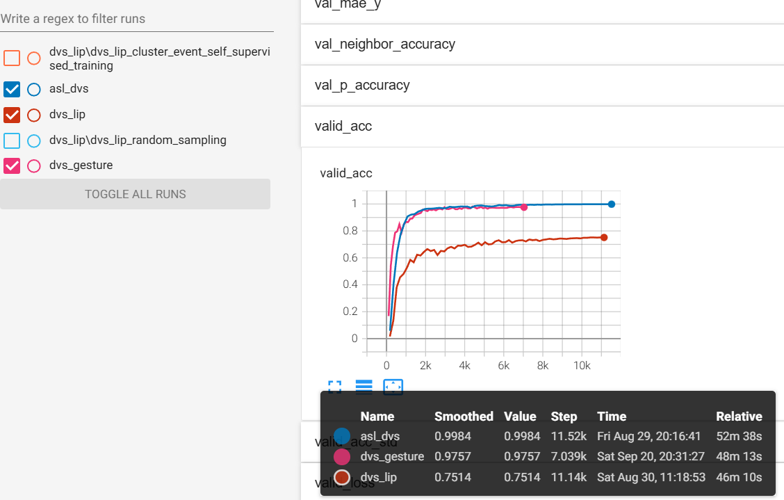

# Event2Vec: Processing Neuromorphic Events Directly with Vector Space Representations

This repository contains the source code, training logs, and models for the article [Event2Vec: Processing Neuromorphic Events Directly with Vector Space Representations](https://arxiv.org/abs/2504.15371).

If you are looking for code for old versions of the ArXiv paper, you can just checkout to the corresponding branch:

arxiv_v1: https://github.com/Intelligent-Computing-Lab-Panda/event2vec/tree/arxiv_v1?tab=readme-ov-file

arxiv_v2: https://github.com/Intelligent-Computing-Lab-Panda/event2vec/tree/arxiv_v2?tab=readme-ov-file

## Dependencies

The `environment.yml` file lists the Conda environment we used for all experiments. However, you likely won't need all of them. The essential dependencies are:

```
torch
pytorch-lightning
triton
flash-linear-attention
scikit-learn
tensorboard # Optional, but required for TensorBoard logs. Otherwise, only CSV logs are generated.
```

The GPU must support BFloat16 because we use the [FoX](https://arxiv.org/abs/2503.02130) linear attention from `flash-linear-attention`, which only provides a BFloat16 Triton kernel. However, if you want to run the model on older GPUs (such as the NVIDIA V100), you can replace FoX with the [gated linear attention](https://arxiv.org/abs/2312.06635), which should only cause a slight drop in accuracy.

By default, FLA runs a Triton auto-tune process to find the optimal hyperparameters for maximum speed. However, this process is time-consuming. Therefore, we use a monkey patch to disable the auto-tune function in `train_script.py`:

```
triton.autotune = patched_autotune
```

To re-enable the auto-tune function, simply comment out this line.

## Checking Training Logs

The full training logs and terminal outputs are provided in the `logs_` directory.

Launch TensorBoard and set the log directory as follows:

```
tensorboard.exe --logdir=./logs_
```

The accuracy shown in the figure above corresponds to the results we reported in the main text.



You can also open `out.txt` in each log folder to see the original terminal output, for example:

```
# ./logs_/asl_dvs/out.txt
python train_script.py --config ./config/asl_dvs.yaml --trainer.devices='[0,2,3,4,1,6,7]' --model.backbone manual_mlp-2,128,128,2048-0,64,128,2,relu,0 --model.lr 1e-3 --da
ta.root /dev/shm/ASLDVS/events_np --data.sample_number 1024 --trainer.max_epochs 64 --model.warmup_epochs 4 --model.wd 0 --data.
train_full_sample false --data.train_repeats 1 --data.sampler random_sample --data.val_repeats 10 --model.label_smoothing 0 --tr
ainer.precision bf16-mixed --trainer.logger.class_path=TensorBoardLogger --trainer.logger.init_args.version=5 --trainer.logger.init_args.save_dir=./asl_dvs --model.batch_size 64 --data.batch_size 64
Seed set to 0
params in MB 0.2730560302734375
...
```

Note: The original code we used differs from the code in this repository. The original code was disorganized, so we simplified and refined it before release. Consequently, you may notice slight differences between our provided logs and the logs generated when you re-run the experiments.

## Preparing Datasets

By default, we store all datasets in `/dev/shm`, which maps them to RAM for faster access.

You can use [SpikingJelly](https://github.com/fangwei123456/spikingjelly) to generate events in NumPy format. Refer to their [tutorial](https://spikingjelly.readthedocs.io/zh-cn/latest/activation_based_en/neuromorphic_datasets.html) for more details.

For example, you can use the following code:

```
from spikingjelly.datasets.asl_dvs import ASLDVS

root_dir = './datasets/ASLDVS'
train_set = ASLDVS(root_dir, data_type='event')
print(train_set[0][0])
```

You will get output like this:

```
NpzFile './datasets/ASLDVS/events_np/a/a_0001.npz' with keys: t, x, y, p
```

Note that we **do not need frames**, so you should use `data_type='event'`. However, you can also use SpikingJelly to integrate events into frames and play them as GIFs to visualize the data.

##### ASL-DVS

After processing, the ASL-DVS dataset should have the following directory structure:

```
/dev/shm/ASLDVS/
└── events_np
    ├── a
    │   ├── a_0001.npz
    ...
    └── y
        ├── y_4200.npz
```

##### DVS Gesture

After processing, the DVS Gesture dataset should have the following directory structure:

```
/dev/shm/DVS128Gesture/
└── events_np
    ├── test
    │   ├── 0
    │   │   ├── user24_fluorescent_0.npz
    ...
    │   ├── 9
    │   │   ├── user23_led_0.npz
```

##### DVS-Lip

The DVS-Lip dataset is already in a native NumPy format. Its directory structure should be as follows:

```
/dev/shm/dvs_lip/
├── test
│   ├── accused
...
│   └── young
└── train
    ├── accused
  ...
    └── young
```

You can run the k-means algorithm to cluster the dataset:

```
python check_dataset.py
```

After processing, the dataset should have the following directory structure:

```
/dev/shm/dvs_lip/
├── kmeans_1024
│   ├── test
│   ├── train
├── test
└── train
```

## Training Models and Checkpoints

Checkpoints are available at https://huggingface.co/fangwei123456/event2vector_checkpoints.

You can use the `--data.root xxx` argument to override the default dataset path if necessary.

##### ASL-DVS

```
python train_script.py --config ./config/asl_dvs.yaml
```

The resulting checkpoint will be saved as `asl_dvs.ckpt`.

##### DVS Gesture

```
python train_script.py --config ./config/dvs_gesture.yaml
```

The resulting checkpoint will be saved as `dvs_gesture.ckpt`.

##### DVS-Lip

The first step is to train the model on DVS-Lip in a self-supervised mode:

```
python train_script.py --config ./config/dvs_lip_cluster_event_self_supervised_training.yaml
```

The resulting checkpoint is `dvs_lip_cluster_event_self_supervised_training.ckpt`.

Then, you can train the classification model for DVS-Lip by loading the self-supervised pre-trained weights.

For clustered events:

```
python train_script.py --config ./config/dvs_lip_cluster_event.yaml --model.load ./checkpoints/dvs_lip_cluster_event_self_supervised_training.ckpt
```

You should see output similar to this:

```
[rank: 0] Seed set to 0
TokenMix initialized with alpha=1.0, num_classes=100
missing state dict keys:
 _IncompatibleKeys(missing_keys=['classifier.heads.weight', 'classifier.heads.bias'], unexpected_keys=['classifier.mask_token', 'classifier.heads.0.weight', 'classifier.heads.1.weight', 'classifier.heads.1.bias', 'classifier.heads.3.weight', 'classifier.heads.4.weight', 'classifier.heads.4.bias', 'classifier.heads.6.weight'])
params in MB 18.307632446289062
```

The missing keys correspond to the classification head. The unexpected keys belong to the module used for predicting coordinates in the self-supervised pre-training task. This is expected behavior and not a bug.

The resulting checkpoint is `dvs_lip_cluster_event.ckpt`.

For randomly sampled events:

```
python train_script.py --config ./config/dvs_lip_random_sampling.yaml --model.load ./checkpoints/dvs_lip_cluster_event_self_supervised_training.ckpt
```

The resulting checkpoint is `dvs_lip_random_sampling.ckpt`.

## Citation

```
@misc{fang2025event2vecprocessingneuromorphicevents,
      title={Event2Vec: Processing Neuromorphic Events Directly by Representations in Vector Space}, 
      author={Wei Fang and Priyadarshini Panda},
      year={2025},
      eprint={2504.15371},
      archivePrefix={arXiv},
      primaryClass={cs.CV},
      url={https://arxiv.org/abs/2504.15371}, 
}
```

